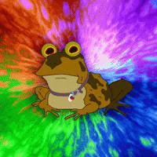

  <!-- You are encouraged to replace this logo with your own! Otherwise you can also remove it. -->
  
   

  <h3><b>Catalog Of My Things</b></h3>

# 📗 Table of Contents

- [📖 About the Project](#about-project)
  - [🛠 Built With](#built-with)
    - [Tech Stack](#tech-stack)
    - [Key Features](#key-features)
  - [💻 Getting Started](#getting-started)
  - [Setup](#setup)
  - [Prerequisites](#prerequisites)
  - [👥 Authors](#authors)
- [🔭 Future Features](#future-features)
- [🤝 Contributing](#contributing)
- [⭐️ Show your support](#support)
- [🙏 Acknowledgements](#acknowledgements)
- [❓ FAQ (OPTIONAL)](#faq)
- [📝 License](#license)

# 📖 [Catalog of my things] 

**[Catalog of my things]** is based on Ruby Language.
In this project, we will create a console app that will help us to keep a record of different types of things our own: books, music albums, movies, and games. Everything will be based on the UML class diagram presented below. The data will be stored in JSON files but our will also prepare a database with tables structure analogical to our program's class structure.

UML class daigram:
 

 
Video Presntation link:

## 🛠 Built With 

### Tech Stack 

  
Client

  <ul>
    <li><a href=#>RUBY</a></li>
  </ul>

  
Server

  <ul>
    <li><a href=#>N/A</a></li>
  </ul>

Database

  <ul>
    <li><a href=#>Local Storage</a></li>
  </ul>

### Key Features 

- **[Create classes and inheritence added]**

()

## 💻 Getting Started 

To get a local copy up and running, follow these steps.

- clone this https://github.com/imranhossainemi/catalog_of_my_things.git

### Prerequisites

In order to run this project you need:

<ul>
    <li><a href="https://www.ruby-lang.org/en/">Ruby</a></li>
  </ul>
  
### Setup

Clone this repository to your desired folder:

<ul>
<li>cd my-folder</li>
<li>git clone https://github.com/imranhossainemi/catalog_of_my_things.git</li>
</ul>

### Install

Install this project with:

<ul>
<li>bundle install</li>
</ul>

### Usage

To run the project, execute the following command:

<ul>
<li>ruby main.rb</li>
</ul>

### Run tests

To run tests, run the following command: Install through : gem install rspec

Run: rspec to tun tests

()

## 👥 Authors 

👤 **Imran Hossain**

- GitHub: [@imranhossainemi](https://github.com/imranhossainemi)

👤 **Ikoote Rasuli**

- GitHub: [@ikoote1](https://github.com/ikoote1)

👤 **Santosh Konappanavar**

- GitHub: [@Santosh-Konappanavar](https://github.com/Santosh-Konappanavar)

()

<!-- FUTURE FEATURES -->

## 🔭 Future Features 

- [ ] **[More conditional checking and features will be added in future]**

()

## 🤠Contributing 

Contributions, issues, and feature requests are welcome!

Feel free to check the [repo:https://github.com/imranhossainemi/catalog_of_my_things.git]

()

## ⭐️ Show your support 

If you like this project please follow me on github

()

## 🙠Acknowledgments 

I would like to thank Microverse.

()

## ❓ FAQ 

- **[What is School Library Project?]**

  - [In this project, we will create an app that keeps records of books, games, and music album.]

()

## 📠License 

This project is [MIT](./LICENSE) licensed.

()

